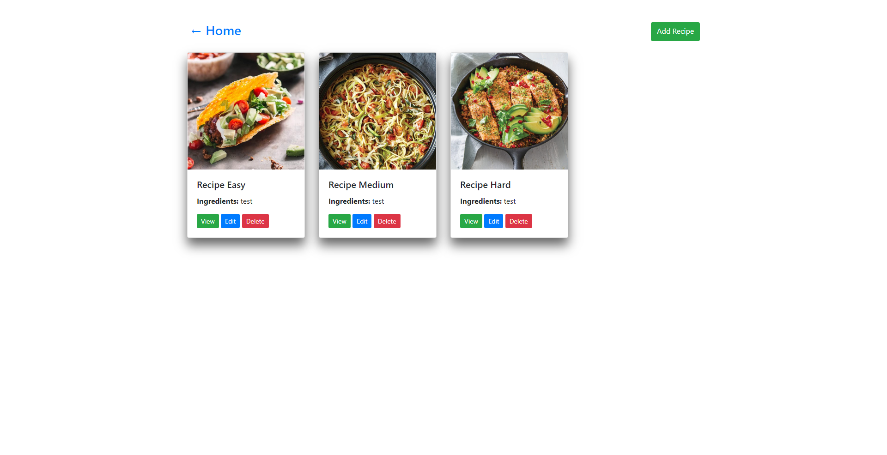
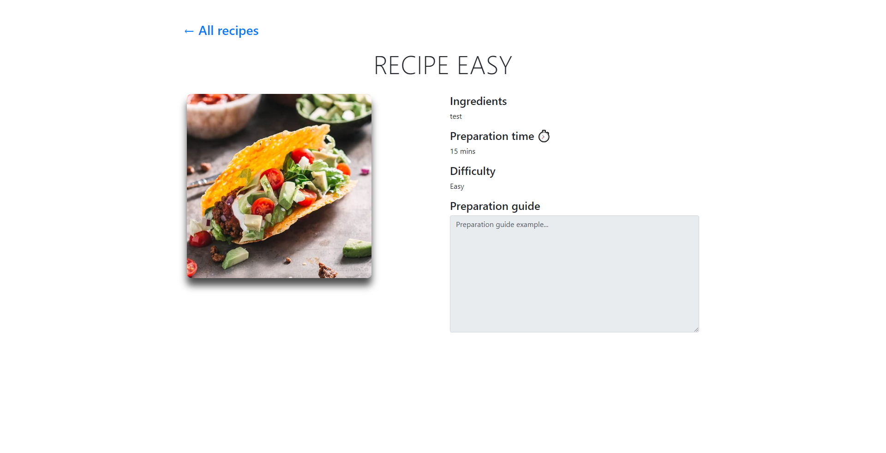

# RecipesApp

A Server Side Rendered web application using Django and Nuxt.js. 

## Screenshots
<p align="center">
    
    
</p> 

## Requirements
* [Python 3.7.4](https://www.python.org/downloads/release/python-374/)
* [Pipenv](https://pypi.org/project/pipenv/)
* [Npm](https://www.npmjs.com/) or [Yarn](https://yarnpkg.com/en/)

## Built With

* [Python 3.8.2](https://www.python.org/) - A programming language that lets you work quickly and integrate systems more effectively.
* [Django](http://djangoproject.org/) - A high-level Python Web framework that encourages rapid development and clean, pragmatic design.
* [Nuxt](https://nuxtjs.org/) - Nuxt.js is a minimal framework for creating Vue.js applications with server side rendering, code-splitting, hot-reloading, static generation and more.

## How to setup and run
Clone the project 
``` 
git clone https://github.com/vcjpierre/django-nuxt-recipes
```

Navigate into the diretory 
``` 
cd django-nuxt-recipes 
```

Source the virtual environment 
``` 
pipenv shell 
```
 
Install the dependencies 
``` 
pipenv install 
```

Navigate into the backend directory 
``` 
cd api 
```

Make migrations
``` 
python manage.py migrate
```

Start the backend server 
``` 
python manage.py runserver 
```

Go to ``` http://localhost:8000/api/ ```

Then open a new terminal and navigate into the frontend directory 
``` 
cd client 
```
 
Install dependencies 
``` 
npm install 
```

Start the frontend development server 
``` 
npm run dev 
```
 
Go to
``` 
http://localhost:3000 
```